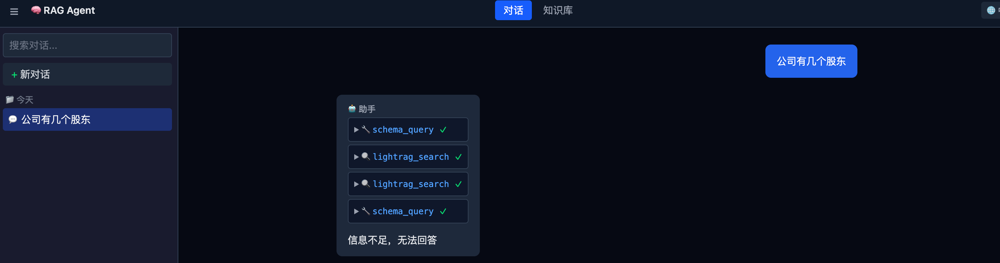
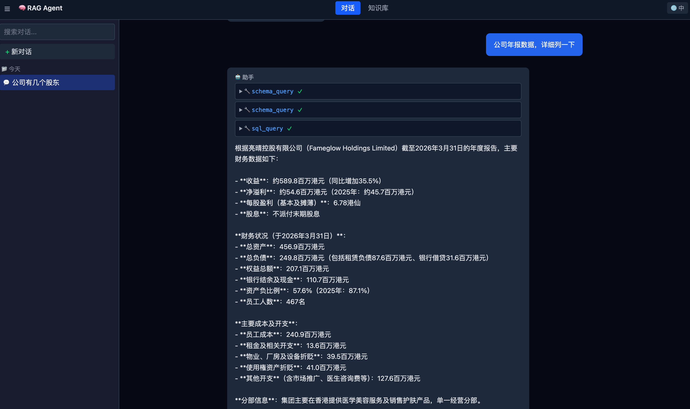
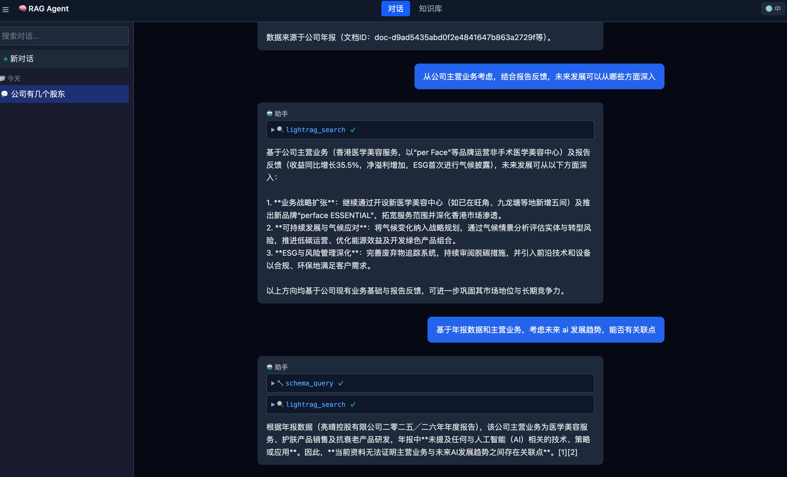
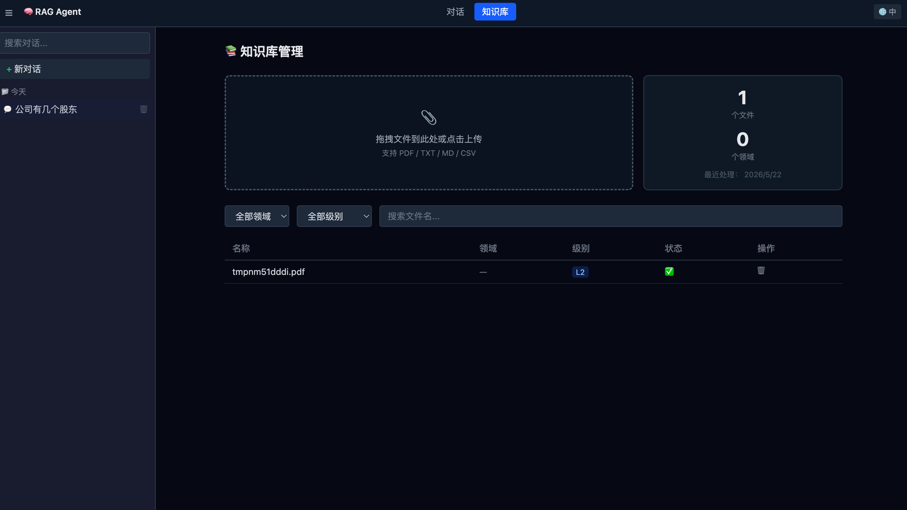

# RAG Agent

RAG 智能体，基于 PostgreSQL AGE 图数据库实现 LightRAG，支持多轮反思、工具调用链、图谱 + 向量混合检索，前端通过 SSE 实时展示 Agent 推理过程。

**传统 RAG 的三大短板**：

1. **逻辑查询无能为力**——普通 RAG 先用小模型生成检索词、再走向量库，面对"统计文档数量""去年华东区供应商延迟率""财报中盈利最高的公司"这类跨文档聚合、需要结合数据库的计算型问题完全束手无策。

2. **跨文档关联断裂**——单次向量检索返回孤立片段，无法串起分散在多份文档中的关联信息（如"A 公司的股东"出现在年报、"A 公司营收"出现在另一份财报），因为没有图谱结构承载实体关系。

3. **幻觉风险高**——单次检索没有二次校验，检索结果为空或质量差时 LLM 容易编造答案。

**本项目提供的方案**：

| 能力 | 实现方式 | 解决痛点 |
|------|----------|----------|
| **Tool + 多轮反思** | Agent 通过 `decide → execute → reflect` 循环自主选择 tool（schema_query / sql_query / lightrag_search / python_calc），每轮检查信息是否充足 | 逻辑查询、DB 联动、消除幻觉 |
| **LightRAG 知识图谱** | 图 + 向量 + 关键词三路混合检索，自动提取实体/关系构建知识网络 | 跨文档关联、综合文档理解 |
| **函数调用链** | LLM 先查 schema 获取表结构，再写 SQL 精准查询，或搜 LightRAG 图谱，需要时结合计算结果 | 数据库无缝联动 |

**为什么选 LightRAG 而非其他 RAG 框架**：

- **三合一检索**：graph local/global + vector + keyword，一次调用覆盖精确匹配、全局摘要和语义搜索
- **省 token 且快**：实体/关系以结构化形式存储，查询时不需塞入大片原始文本，输入 token 远低于纯向量 RAG
- **增量更新**：文档变更时只更新受影响的实体/关系，无需全量重建索引

**整体效果**：

用户提问"公司有几个股东"→ Agent 自动查 LightRAG 图谱获取股东信息 → 反思确认完整 → 流式返回答案。提问"知识库中有哪些文档"→ 先查 schema 获取表名 → 查表列定义 → 执行 SQL → 返回结果。全过程前端通过 SSE 实时展示每步推理，用户对 Agent 决策路径完全可见。

---

## 展示





---

## 架构

```
┌─────────────────────────────┐
│     Frontend (React + Vite)  │  ← SSE 流式聊天 + 知识库管理
├─────────────────────────────┤
│      API 层 (FastAPI)        │  ← REST + SSE 端点
├─────────────────────────────┤
│      Core 层                 │  ← Agent 编排、决策/反思引擎、工具
├─────────────────────────────┤
│     Domain 层                │  ← ORM 模型、Pydantic Schema、枚举
├─────────────────────────────┤
│  Infrastructure 层           │  ← PostgreSQL、Redis、MinIO、LLM、LightRAG
└─────────────────────────────┘
```

## 快速启动

### 前置条件

- Python ≥3.11
- Node.js ≥18
- Docker & Docker Compose
- DeepSeek API Key + SiliconFlow API Key

### 1. 克隆并配置环境

```bash
cp .env.example .env  # 填入 DEEPSEEK_API_KEY 和 SILICONFLOW_API_KEY
```

### 2. 启动基础设施

```bash
docker compose up -d        # PostgreSQL + Redis + MinIO
poetry install              # 后端依赖
cd frontend && npm install  # 前端依赖
```

### 3. 数据库迁移

```bash
poetry run alembic upgrade head
```

### 4. 启动服务

```bash
# 后端（端口 8000）
poetry run uvicorn src.rag_agent.main:app --reload

# 前端（端口 5173）
cd frontend && npm run dev
```

### 5. 访问

| 地址 | 说明 |
|------|------|
| http://localhost:5173 | 前端界面 |
| http://localhost:8000/docs | Swagger API 文档 |
| http://localhost:8000/health | 健康检查 |

## 项目结构

```
rag-agent/
├── src/rag_agent/           # 后端源码
│   ├── main.py              # FastAPI 入口
│   ├── config.py            # pydantic-settings 配置
│   ├── api/                 # API 层
│   │   ├── deps.py          # 依赖注入
│   │   ├── sse_protocol.py  # SSE 事件格式化
│   │   └── routes/          # agent / conversations / documents / knowledge_domains
│   ├── core/                # 核心层
│   │   ├── orchestrator.py  # Agent 编排（同步 + SSE 流式）
│   │   ├── engine.py        # 决策 & 反思引擎
│   │   ├── pipeline.py      # 文档摄取管道（PDF/TXT/MD/CSV）
│   │   ├── graph_service.py # LightRAG 索引维护
│   │   └── tools/           # schema_query / sql_query / lightrag_search / python_calc
│   ├── domain/              # 领域层
│   │   ├── models.py        # ORM 模型
│   │   ├── schemas.py       # Pydantic Schema
│   │   └── enums.py         # 枚举
│   └── infrastructure/      # 基础设施层
│       ├── db.py            # 数据库连接
│       ├── llm.py           # LLM 客户端
│       ├── lightrag.py      # LightRAG 封装
│       ├── cache.py         # Redis 语义缓存
│       ├── filestore.py     # MinIO 文件存储
│       └── sandbox.py       # Docker 沙箱
├── frontend/                # 前端源码
│   └── src/
│       ├── api/             # HTTP + SSE 客户端
│       ├── components/      # UI 组件
│       ├── pages/           # ChatPage / KnowledgePage
│       ├── hooks/           # useSSE / useConversations
│       ├── stores/          # Zustand 状态管理
│       ├── i18n/            # 中英文国际化
│       └── types/           # TypeScript 类型
├── alembic/                 # 数据库迁移
├── docker/                  # PostgreSQL AGE Dockerfile
├── tests/                   # 单元测试
└── docs/                    # 设计文档
```

## Agent 工作流

```
用户提问
  → 决策引擎 (decide): 分析问题，选择工具
    ├── schema_query: 查询表名 → 查询列定义 → sql_query
    ├── lightrag_search: 图 + 向量 + 关键词混合检索
    ├── python_calc: Docker 沙箱执行
    ├── answer: 信息充足 → 返回答案
    └── give_up: 放弃回答
  → 反思引擎 (reflect): 评估结果，决定 CONTINUE / ANSWER / GIVE_UP
  → 循环（最多 8 轮）
  → SSE 流式返回答案 + 工具调用步骤
```

## 开发命令

| 用途 | 命令 |
|------|------|
| 安装依赖 | `poetry install` |
| 启动基础设施 | `docker compose up -d` |
| 开发服务器 | `uvicorn src.rag_agent.main:app --reload` |
| 前端开发 | `cd frontend && npm run dev` |
| 数据库迁移 | `poetry run alembic upgrade head` |
| 生成迁移 | `poetry run alembic revision --autogenerate -m "..."` |
| 运行测试 | `pytest` |
| Lint | `ruff check src/ tests/` |
| 类型检查 | `mypy src/` |

## 文档索引

| 文档 | 说明 |
|------|------|
| `AGENTS.md` | AI 智能体入口 + 铁律 |
| `docs/architecture.md` | 高层架构 + 数据流 |
| `docs/project-design-init.md` | 原始设计方案（只读） |
| `docs/project-frontend-design.md` | 前端设计方案 |
| `docs/conventions.md` | 编码规范 |
| `docs/modules/api.md` | API 接口文档 |
| `docs/modules/core.md` | Core 层模块文档 |
| `docs/modules/domain.md` | Domain 层模块文档 |
| `docs/adr/` | 架构决策记录 |
